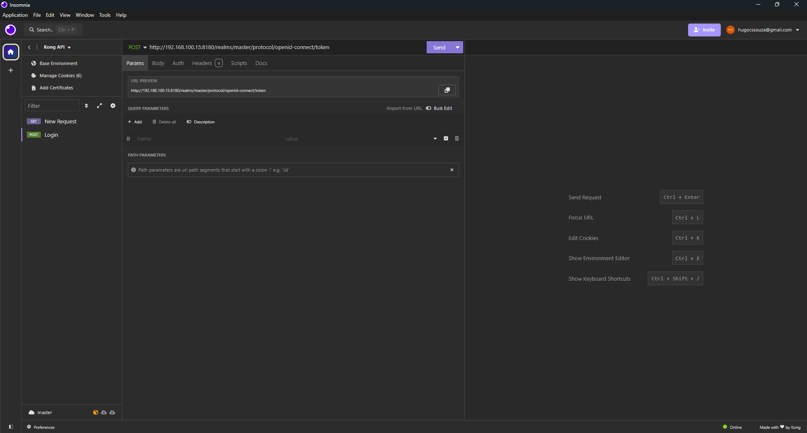

# Desafio de desenvolvimento

## Primeiro passo - Kong

O inicio do desenvolvimento do projeto passa pela iniciação da API Gateway Kong via docker. Ela quem vai gerenciar o acesso aos microsservicos que vamos subir posteriormente

### Configuração do docker-compose

O docker compose é o arquivo que contem as instruções e configurações para que você gerencie varios conteineres de uma vez só, ao invés de ficar iniciando e configurando container por container.  

### Definição do endereço das portas

- 8000 : Acesso ao gateway de entrada
- 8001 : API Admin

### Configuração e Inicialização da imagem docker

Depois de buildar a imagem, faça primeiro a inicialização do container pelos bancos de dados, tanto do kong quanto do keycloack

``` CLI
docker compose -f .\docker\kong\docker-compose.yml up db keycloak-db -d
```

### Kong

Depois crie a migration para conexão do kong com o banco de dados

```CLI
docker compose -f .\docker\kong\docker-compose.yml up kong-migration -d
```

A migration irá iniciar e finalizar, é o normal. Ela cria os caminhos de conexão entre o Kong e o banco de dados. Dai, tu suba o kong e o Keycloak.

```CLI
docker compose -f .\docker\kong\docker-compose.yml up kong keycloak -d
```

Tente verificar se o kong subiu via web ou curl através do <http://localhost:8001>. Verificado que o kong está online, se o plugin de openID connecition (serviço de autenticação está online). Caso não, verifique a build da sua imagem.

```CLI
# Execute uma linha por vez

$response = Invoke-WebRequest -Uri "http://localhost:8001"
$json = $response.Content | ConvertFrom-Json
$json.plugins.available_on_server.oidc

```

O comando Invoke-Webrequest vai fazendo um solicitação HTTP a URI/URL informada como argumento após o argumento nomeado "-Uri" e armazena na variável *response*. Após isso, pega o conteudo da variável e converte para json e armazena na varíavel *json*. Então, se verifica se o Plugin OIDC está disponivel dentro do Kong. Se a resposta destes comandos foi "True", o serviço está ativo.

Verificado se o plugin está funcionando, crie os serviços e rotas para conectar o Kong ao gateway.

```CLI
# Execute uma linha por vez

$uri = "http://localhost:8001/services"

$body = @{
    name = "openid-connect"
    url = "http://httpbin.org/anything"
}

$headers = @{
    "Content-Type" = "application/x-www-form-urlencoded"
}

$response = Invoke-WebRequest -Uri $uri -Method POST -Body $body -Headers $headers

$json = $response.Content | ConvertFrom-Json

$json | ConvertTo-Json -Depth 10

```

Nos variáveis body e headers, o @ é utilizado para definir uma tabela hash (chave-valor). Já o |(pipe) é utilizado para passar a saida de um comando para outro. A resposta da variável Json convertida deve ter aproximadamente este formato:

```Json
{
    "host":  "httpbin.org",
    "tls_verify_depth":  null,
    "tags":  null,
    "path":  "/anything",
    "retries":  5,
    "port":  80,
    "client_certificate":  null,
    "updated_at":  1722201439,
    "created_at":  1722201439,
    "id":  "8292a3eb-67f7-45f8-9fa9-1968f259a8c3",
    "read_timeout":  60000,
    "connect_timeout":  60000,
    "protocol":  "http",
    "write_timeout":  60000,
    "enabled":  true,
    "ca_certificates":  null,
    "name":  "openid-connect",
    "tls_verify":  null
}
```

Com essa resposta, usaremos para criar uma rota, através do para o serviço de conexão.

```CLI
# Execute uma linha por vez

$uri = "http://localhost:8001/services/openid-connect/routes"

$body = @{
    "name" = "openid-connect"
    "paths[]" = "/"
}

$response = Invoke-WebRequest -Uri $uri -Method POST -Body $body

$json = $response.Content | ConvertFrom-Json

$json | ConvertTo-Json -Depth 10

```

E terá como resposta, um arquivo Json

```JSON
{
    "destinations":  null,
    "snis":  null,
    "tags":  null,
    "headers":  null,
    "protocols":  [
                      "http",
                      "https"
                  ],
    "name":  "openid-connect",
    "request_buffering":  true,
    "regex_priority":  0,
    "service":  {
                    "id":  "8292a3eb-67f7-45f8-9fa9-1968f259a8c3"
                },
    "path_handling":  "v0",
    "updated_at":  1722201489,
    "created_at":  1722201489,
    "id":  "8e4be3da-b323-40a8-9da9-81a9e9178bbf",
    "hosts":  null,
    "response_buffering":  true,
    "strip_path":  true,
    "https_redirect_status_code":  426,
    "preserve_host":  false,
    "paths":  [
                  "/"
              ],
    "methods":  null,
    "sources":  null
}
```

Após isso, deve-se configurar a sessão de autenticação do Kong via Keycloak. Para isso será necessário o ID do client service.

### OIDC

Para configurar o OIDC (plugin de autenticação), é preciso fornecer a ele, o Client ID, o Cliente Secret e o endpoint discovery.  Para acessar o discovery endpoint, que é onde o kong irá pegar informaçãoes para a autenticação, execute as linhas abaixo.

```CLI
# Execute uma linha por vez

$uri = "http://localhost:8180/realms/master/.well-known/openid-configuration"

$response = Invoke-RestMethod -Uri $uri -Method Get

$formattedResponse = $response | ConvertTo-Json -Depth 10

Write-Output $formattedResponse

```

Por estar "Conteinerizado", cada imagem está no seu proprio container, portanto, o localhost do kong só é acessivel a ele mesmo. Para permiti-lo acessar o keycloack para fazer a verificação de ID, encontre o ip da sua maquina, o secret do keycloak para endereçar para o kong

```CLI
$host_ip = "192.168.100.15" #Descubra seu ip com ipconfig

$secret_client = "VJgP3NXKhZxyHWpBh0FXGDSiwzbAkQQl" #Está no keycloak no client criado "kong"

$uri = "http://localhost:8001/plugins"

$body = @{
    name = "oidc"
    config = @{
        client_id = "kong"
        client_secret = ${secret_client}
        discovery = "http://${host_ip}:8180/realms/master/.well-known/openid-configuration"
    }
}
$jsonBody = $body | ConvertTo-Json

$response = Invoke-WebRequest -Uri $uri -Method POST -Body $jsonBody -ContentType "application/json"

$json = $response.Content | ConvertFrom-Json

$formattedResponse = $json | ConvertTo-Json -Depth 10

Write-Output $formattedResponse

```

Caso positivo, sua repostas será um arquivo JSON com estes campos.

```Json
{
    "enabled":  true,
    "consumer":  null,
    "tags":  null,
    "created_at":  1722201726,
    "service":  null,
    "config":  {
                   "client_id":  "kong",
                   "client_secret":  "VJgP3NXKhZxyHWpBh0FXGDSiwzbAkQQl",
                   "discovery":  "http://192.168.100.15:8180/realms/master/.well-known/openid-configuration",
                   "introspection_endpoint_auth_method":  null,
                   "redirect_uri_path":  null,
                   "response_type":  "code",
                   "token_endpoint_auth_method":  "client_secret_post",
                   "logout_path":  "/logout",
                   "redirect_after_logout_uri":  "/",
                   "session_secret":  null,
                   "scope":  "openid",
                   "introspection_endpoint":  null,
                   "recovery_page_path":  null,
                   "bearer_only":  "no",
                   "realm":  "kong",
                   "filters":  null,
                   "ssl_verify":  "no"
               },
    "protocols":  [
                      "grpc",
                      "grpcs",
                      "http",
                      "https"
                  ],
    "id":  "7cd84221-330f-4b03-bb0c-891abfbcf818",
    "name":  "oidc",
    "route":  null
}
```

### Conexão

Para verificar se a credencial está funcionando via CLI, execute

```CLI
# Execute uma linha por vez

# 
$user = "user"
$password = "123"
$url = "http://localhost:8000"
$cookieFile = "example-user"

# Crie uma instância de WebRequest com autenticação e cookies
Invoke-WebRequest -Uri $url -Credential (New-Object PSCredential($user, (ConvertTo-SecureString $password -AsPlainText -Force))) -SessionVariable webSession

# Salve os cookies da requisição
$cookies = $webSession.Cookies.GetCookies($url)

$cookies | ForEach-Object {
    "$($_.Name)=$($_.Value)"
} | Out-File -FilePath $cookieFile


```

Você tera a saida em um objeto PowerShell semelhante a este:

```PowerShell
StatusCode        : 200
StatusDescription : OK
Content           : <!DOCTYPE html>
                    <html class="login-pf">

                    <head>
                        <meta charset="utf-8">
                        <meta http-equiv="Content-Type" content="text/html; charset=UTF-8" />
                        <meta name="robots" content="noindex, nofollow"...
RawContent        : HTTP/1.1 200 OK
                    Referrer-Policy: no-referrer
                    X-Frame-Options: SAMEORIGIN
                    Strict-Transport-Security: max-age=31536000; includeSubDomains
                    X-Robots-Tag: none
                    X-Content-Type-Options: nosniff
                    Content...
Forms             : {kc-form-login}
Headers           : {[Referrer-Policy, no-referrer], [X-Frame-Options, SAMEORIGIN], [Strict-Transport-Security, max-age=31536000; includeSubDomains], [X-Robots-Tag, none]...}
Images            : {}
InputFields       : {@{innerHTML=; innerText=; outerHTML=<INPUT tabIndex=1 id=username class=pf-c-form-control aria-invalid="" name=username autocomplete="off" autofocus>; outerText=; tagName=INPUT; tabIndex=1; id=username;
                    class=pf-c-form-control; aria-invalid=; name=username; autocomplete=off; autofocus=}, @{innerHTML=; innerText=; outerHTML=<INPUT tabIndex=2 id=password class=pf-c-form-control aria-invalid="" type=password value=""
                    name=password autocomplete="off">; outerText=; tagName=INPUT; tabIndex=2; id=password; class=pf-c-form-control; aria-invalid=; type=password; value=; name=password; autocomplete=off}, @{innerHTML=; innerText=;
                    outerHTML=<INPUT id=id-hidden-input type=hidden name=credentialId>; outerText=; tagName=INPUT; id=id-hidden-input; type=hidden; name=credentialId}, @{innerHTML=; innerText=; outerHTML=<INPUT tabIndex=4 id=kc-login
                    class="pf-c-button pf-m-primary pf-m-block btn-lg" type=submit value="Sign In" name=login>; outerText=; tagName=INPUT; tabIndex=4; id=kc-login; class=pf-c-button pf-m-primary pf-m-block btn-lg; type=submit; value=Sign In;    
                    name=login}}
Links             : {}
ParsedHtml        : mshtml.HTMLDocumentClass
RawContentLength  : 3537
```

### Insomnia

Como ao tentar mockar via mockbin não foi possível, é apresentado no site uma alternativa chamada Insomnia. É um app para realizar mockagens para endpoins e fazer requisições HTTP para testar APIs (Estilo PostMan). Baixe o [Insomnia](https://insomnia.rest/download) no site oficial e instale no seu SO. Após instalar, na tela inicial, clique em "*Create*" e clique em collections


Nomeie sua coleção de requests, e você redirecionado a esta seguinte tela apresentada na primeira imagem abaixo. Clique em "New HTTP Request" ou pressione "Ctrl + N".


Para testar se o login está sendo realizado, vá em seu browser, e digite o[ endereço de conexão do kong](http://localhost:8000/anything) (se você está seguindo este exemplo à risca, é só clicar no hyperlink). Você será redicionado a pagina de login do keycloak de autenticação (novamente, se tiver seguindo a risca este exemplo o link de redirecionamento será http://{seu_ip}:8180/realms/master/protocol/openid-connect/auth). Troque o endpoint por "*token*" e digite na barra de url da sua requisição do Insomnia.



Então, clique em body, e adicione as variáveis: *client_id*, *grant_type*, *client_secret*, *username* e *password*. Mude o tipo de requisição para POST onde a seta vermelha está indicando, e clique em send na seta amarela. Se tudo estiver correto, sua requisição receberá resultado 200.


Se algo estiver errado, como os valores de credenciais do usuário, você receberá erro 401 ou 403.


